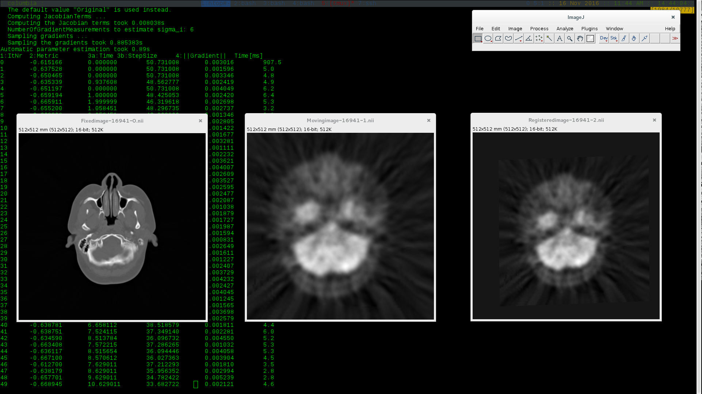

## Image Registration using SimpleElastix

**simpleregister** is a command-line tool which makes the registration between multimodal and monomodal images using [SimpleElastix](https://simpleelastix.github.io/) library. 

```sh
ahestevenz@columbia:~/IP/work/simple-register/build$ ./simpleregister 
Usage: ./simpleregister [options]
Options:
  -h, --help                                       Displays this help.
  -v, --version                                    Displays version
                                                   information.
  -i, --images </directory_1/images/>              Path to moving and fixed
                                                   images.
  -p, --parameters </directory_1/parameter_1.txt>  Path to the parameter file
                                                   configuration.
  -f, --fixed <ct.dmg>                             Fixed image name.
  -m, --moving <pet.dmg>                           Moving image name.
  -r, --registered <pet_reg.dcm>                   Registered image name.
  -s, --show <OK>                                  Show information on the
                                                   console.
```

For the tests it has been used [Testing Datasets](http://www.insight-journal.org/rire/download_data.php) from [Insight Journal Foundation](http://www.insight-journal.org/). 
The following figure shows a simple example of the application execution.

<p align="center"></p>

